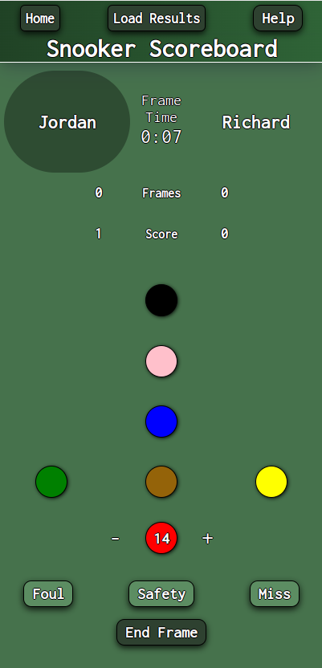

# Sports Scoreboard App

### <a href="https://jordaneckfordscoreboardapp.netlify.app/index.html">View the live app</a>

## What is this app?

This scoreboard app is specifically designed for mobiles to provide easy and engaging ways for user to record scores of popular sports bar games- Snooker, Pool, & Darts
 
Users can easily record scores as they are playing and scores will be automatically calculated. Once games are over, scores are recorded and saved, and data is reset automatically ready for the next game.
 
Rules for each game are taken into account where relevant, so no incorrect score can be inputted. Users will also be notified if mistakes have been made so they can be corrected.
 
The app enhances user interactivity and engagement through dynamic DOM manipulation with JavaScript.

## Tech Stack:

- ![HTML5][htmlimg]
- [![Javascript][Javascriptimg]][Javscript-url]
- ![CSS][CSS]

## Screenshots

[htmlimg]: https://img.shields.io/badge/HTML5-E34F26?style=for-the-badge&logo=html5&logoColor=white
[Javascriptimg]: https://img.shields.io/badge/JavaScript-F7DF1E?style=for-the-badge&logo=javascript&logoColor=black
[Javscript-url]: https://www.javascript.com
[CSS]: https://img.shields.io/badge/CSS-239120?&style=for-the-badge&logo=css3&logoColor=white
